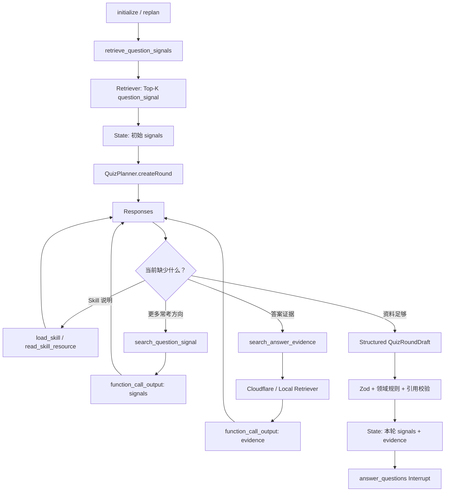

# 06B4：Agentic RAG——固定预取与双检索 Tool

> 类型：`CORE / CONCEPT + GUIDED / AI-IMPLEMENT`。代码起点为 `v0.6.3`。本节仍是单 Agent、一个 `InterviewQuizGraph`，不引入 Reviewer、Subgraph 或子 Agent。

## 0. 最终要做出什么

06B3 的 Graph 在 Planner 运行前固定检索资料。06B4 保留这个稳定入口，同时允许 Planner 根据生成过程中的真实缺口追加搜索：

```text
Graph 固定预取 Top-K question_signal
→ 保证 Planner 一开始就知道行业常考什么

Planner 调用 search_question_signal
→ 初始方向太宽或覆盖不足时，追加检索常考题信号

Planner 调用 search_answer_evidence
→ 准备具体题目后，检索能证明答案和解析的官方资料
```

最终 Web 行为不变：

- 一次显示五道单选/多选题；
- 正确答案、解析、Chunk 和 Tool Trace 不发送给 Web；
- TypeScript 负责判分和引用校验；
- 下一轮重新检索，不永久携带上一轮 Chunk 正文。

## 1. 为什么既有固定预取，又有 Function Tool

资料越来越多，不等于要把整个知识库塞进上下文。无论 Graph 还是 Tool 调用 Retriever，都只返回 Top-K：

| 模式 | 谁决定 Query 和时机 | 返回多少 | 作用 |
|---|---|---:|---|
| Workflow RAG | Graph | 固定 Top-K | 给每轮一个稳定的常考方向起点 |
| Agentic RAG | Planner/LLM | 每次固定 Top-K | 模型发现缺口后改写 Query 并追加搜索 |

两者解决的是“控制权”问题，不是“数据量”问题。

第一轮 Query 只能根据难度、策略和错题知识点生成，它还不知道模型最终准备出的五道题，因此可能出现：

- 常考题信号太宽，缺少某个具体方向；
- 模型准备题目时才发现答案证据不足；
- 第一次搜索词不准确，需要根据结果缩小范围；
- 一份官方资料只能支持部分题目。

还要区分两种缺口：

| 缺口 | 正确动作 |
|---|---|
| 用户目标、范围或配置不明确 | `interrupt()` 追问用户 |
| 任务明确，但缺少常考方向或事实证据 | 调用 RAG Tool |

RAG 不能替用户补充没有表达的意图。

## 2. 资料角色与信任边界

```text
interview-bank / 网友题目
→ question_signal
→ 只能决定“考什么”

OpenAI、LangGraph、Cloudflare 等核验资料
→ answer_evidence
→ 用于证明“正确答案为什么成立”

Planner 生成并通过引用校验的题目
→ 06C D1 QuestionBank
```

即使八股文自带答案，也不能未经核验升级为 `answer_evidence`。最终 `sourceChunkIds` 只能引用本轮实际返回过的 `answer_evidence`。

## 3. Responses Tool Loop 是怎样发生的

自定义 Cloudflare 检索无法向一个正在生成的 Response 热插入上下文。每次搜索都必须走完整协议：

```text
Responses
→ function_call
→ ToolExecutor 执行 Retriever
→ function_call_output
→ 下一次 Responses
```

Planner 可以连续调用不同 Tool，但 TypeScript Harness 控制轮次、搜索次数和 Chunk 总量。

## 4. 完整类型

先理解这里的类型，再进入实现步骤。

### 4.1 Knowledge Tools

文件：`src/tools/knowledge/index.ts`

```ts
import type { KnowledgeRetriever, RetrievedChunk } from '@/knowledge/contracts'
import type { MiniTool } from '@/tools/_core/types'
import { z } from 'zod/v4'

export enum KnowledgeToolName {
  SearchQuestionSignal = 'search_question_signal',
  SearchAnswerEvidence = 'search_answer_evidence',
}

export const SearchKnowledgeInputSchema = z.object({
  query: z.string().trim().min(3).max(300),
}).strict()

export interface SearchKnowledgeOutput {
  chunks: RetrievedChunk[]
}

export function createSearchQuestionSignalTool(
  retriever: Pick<KnowledgeRetriever, 'search'>,
): MiniTool

export function createSearchAnswerEvidenceTool(
  retriever: Pick<KnowledgeRetriever, 'search'>,
): MiniTool
```

模型只能提交 `query`。下面这些字段由服务端固定，不能让模型选择：

```text
evidenceRole
limit
source adapter
AbortSignal
每段正文最大长度
```

### 4.2 Planner 输入、依赖和结果

文件：`src/agent/interview-quiz/planning.ts`

```ts
export interface QuizPlannerOptions {
  skillCatalog: readonly SkillCatalogEntry[]
  questionSignalRetriever: Pick<KnowledgeRetriever, 'search'>
  answerEvidenceRetriever: Pick<KnowledgeRetriever, 'search'>
}

export interface QuizPlannerInput {
  history: OpenAIResponseInputItem[]
  round: number
  difficulty: QuizDifficulty
  strategy: QuizStrategy
  previousQuestionStems: string[]

  // Graph 首次固定预取的 question_signal。
  retrievedChunks: RetrievedChunk[]
}

export type QuizPlanResult =
  | {
      ok: true
      draft: QuizRoundDraft
      continuationItems: OpenAIResponseInputItem[]

      // Graph 预取 + 两个 Tool 在本轮实际返回的有界 Chunk。
      retrievedChunks: RetrievedChunk[]
      usage?: QuizModelUsage
    }
  | {
      ok: false
      error: QuizPlanError
    }
```

Planner 必须返回本轮实际见过的 Chunk。Graph 和 Validator 不能根据模型输出猜测它查过什么。

### 4.3 Graph 依赖

```ts
export interface CreateInterviewQuizGraphOptions {
  checkpointer: BaseCheckpointSaver
  planner: Pick<QuizPlanner, 'createRound' | 'materializeRoundPlan'>

  // 只负责 Graph 首次固定预取。
  questionSignalRetriever: Pick<KnowledgeRetriever, 'search'>
}
```

两个可调用 Retriever 由 Planner 持有。Graph 不直接持有 `answerEvidenceRetriever`。

### 4.4 确定性预算

```ts
export const MAX_PLANNER_TOOL_ROUNDS = 6
export const MAX_QUESTION_SIGNAL_SEARCHES = 1
// 五道题最多各提出一次证据搜索；仍由总 Chunk 数限制上下文。
export const MAX_ANSWER_EVIDENCE_SEARCHES = 5
export const MAX_QUESTION_SIGNAL_CHUNKS = 8
export const MAX_ANSWER_EVIDENCE_CHUNKS = 12
```

每次 Tool 的 Top-K 也由服务端固定：

```ts
export const QUESTION_SIGNAL_LIMIT_PER_SEARCH = 5
export const ANSWER_EVIDENCE_LIMIT_PER_SEARCH = 5
```

预算不是 Prompt 建议。模型一次并行请求多个搜索时，也必须在执行前整体检查，不能先超额调用再报错。

## 5. 文件结构

```text
src/tools/knowledge/
└─ index.ts                    两个只读 Knowledge Tool

src/agent/interview-quiz/
├─ planning.ts                Skill + Knowledge 共用一个 Tool Loop
├─ interview-quiz-graph.ts    只固定预取 question_signal
└─ errors.ts                  Planner Tool、检索预算和证据错误

src/composition-root.ts       明确装配两个 Retriever 的消费者

skills/knowledge-retrieval/
└─ SKILL.md                   告诉模型何时查方向、何时查证据

tests/tools/
└─ knowledge-tools.test.ts

tests/agent/interview-quiz/
├─ planning.test.ts
└─ interview-quiz-rag.test.ts
```

不要增加 `RagManager`、`KnowledgeAgent`、`RetrievalService` 或第二个 StateGraph。

## 6. 谁创建、谁持有、谁调用

| 对象 | 谁创建 | 谁持有 | 谁调用 |
|---|---|---|---|
| 本地 question signal Retriever | Composition Root | Graph + Planner Question Tool | Graph 首次预取；模型可追加一次 |
| Cloudflare answer evidence Retriever | Composition Root | Planner Answer Tool | 模型按需调用 |
| Skill Tools + 两个 Knowledge Tools | Planner 构造时 | Planner | 同一个 Planner Tool Loop |
| 当前 Tool Conversation | `createRound()` | 当前函数调用栈 | 下一次 Responses 请求 |
| 本轮 Chunk 集合 | `createRound()` | 局部变量，成功后写回 State | Validator、Checkpoint |

Composition Root 明确决定装配和离线回退：

```ts
const questionSignalRetriever = localKnowledgeRetriever
const answerEvidenceRetriever =
  cloudflareAnswerEvidenceRetriever ?? localKnowledgeRetriever

const planner = new QuizPlanner(client, model, {
  skillCatalog,
  questionSignalRetriever,
  answerEvidenceRetriever,
})

const graph = createInterviewQuizGraph({
  checkpointer,
  planner,
  questionSignalRetriever,
})
```

如果后面把 `interview-bank` 上传到 Cloudflare，只替换 `questionSignalRetriever` 的 Adapter，不改 Planner、Tool 或 Graph。

## 7. 两个 Knowledge Tool 分别做什么

两个 Handler 结构相同，但角色和描述不能混用：

```ts
createSearchQuestionSignalTool(retriever)
// 固定 filter: question_signal
// 用于补充行业常考方向，不能证明答案

createSearchAnswerEvidenceTool(retriever)
// 固定 filter: answer_evidence
// 用于支持正确答案和解析
```

一次搜索返回空数组是成功结果，不是网络错误。模型可以改写 Query；达到对应搜索预算后停止。

Tool 返回前要：

1. 只保留目标 `evidenceRole`；
2. 每段 `text` 截断到 1200 字符；
3. 保留 `chunkId`、来源、角色和相关度；
4. 不返回 Provider 原始响应。

## 8. Planner 怎样组合 Skill 与 Knowledge Tool

不要嵌套 `createReActGraph()`。继续复用已有 Tool Core：

```text
defineTool
ToolRegistry
ToolExecutor
toResponseTool
toModelTurn
```

Planner 构造时把三类 Tool 注册到同一个 Registry：

```ts
const tools = [
  ...createSkillTools(options.skillCatalog),
  createSearchQuestionSignalTool(options.questionSignalRetriever),
  createSearchAnswerEvidenceTool(options.answerEvidenceRetriever),
]
```

变量使用通用名称：

```text
skillToolRuntime  → toolExecutor + toolDefinitions
skillConversation → plannerConversation
skillToolRunId    → plannerToolRunId
```

不要再创建 `PlannerToolManager`。

## 9. Prompt 与 Knowledge Retrieval Skill

稳定 Instructions 只声明硬边界：

```text
question_signal 只能决定考察方向；
方向不足时可调用 search_question_signal；
没有足够 answer_evidence 时必须调用 search_answer_evidence；
最终只能引用本轮实际返回的 answer_evidence chunkId。
```

`skills/knowledge-retrieval/SKILL.md` 负责策略：

- 用难度、知识点和常见误区组成 Signal Query；
- 结果太宽时增加具体概念；
- 用准备生成的题目知识点组成 Evidence Query；
- Evidence Search 最多五次，尽量让一次 Query 覆盖相关知识点；
- 空结果时换同义词，不得伪造来源；
- 达到预算仍无证据时停止并失败。

Prompt 协议发生变化，缓存版本升级：

```ts
export const AGENT_QUIZ_PROMPT_CACHE_KEY = 'agent-interview-quiz:v3'
```

不要把 `threadId`、Query 或难度拼进 Cache Key。

## 10. Planner Tool Loop 的局部状态

这些变量只存在于一次 `createRound()`，不进入 Graph State：

```ts
let plannerConversation = [
  skillCatalogItem,
  ...input.history,
  { role: 'user', content: renderRetrievedKnowledge(input.retrievedChunks) },
]

let availableChunks = dedupeChunks(input.retrievedChunks)
const loadedSkillNames = new Set<SkillName>()
let toolRoundCount = 0
let questionSignalSearchCount = 0
let answerEvidenceSearchCount = 0
```

每一轮执行顺序：

```text
Responses 返回 function_call[]
→ 先统计本轮两种 Knowledge Call
→ 在执行前检查累计预算
→ ToolExecutor 并行执行
→ 按 call_id 生成 function_call_output
→ 合并并按 chunkId 去重
→ 下一次 Responses
```

合并 Chunk 时分别限制两个角色：

```text
question_signal 最多 8 个
answer_evidence 最多 12 个
```

不能直接对全部 Chunk `.slice(0, 12)`，否则可能错误删除另一角色的资料。

## 11. 模型什么时候可以输出最终题卷

没有 Function Call 时按顺序检查：

```text
必需 Skill 是否已加载
→ 是否至少取得一个 answer_evidence
→ 是否有 Structured Output
→ JSON / Zod 边界
→ Quiz 领域规则
→ sourceChunkIds 是否属于本轮 answer_evidence
```

Validator 必须使用动态集合：

```ts
const validationInput = {
  ...input,
  retrievedChunks: availableChunks,
}
```

成功结果返回：

```ts
return {
  ok: true,
  draft: validated.value,
  continuationItems: turn.continuationItems,
  retrievedChunks: availableChunks,
  usage: totalUsage,
}
```

Tool History 不进入长期 `modelHistory`。只有最终回答的 `continuationItems` 被保存。

## 12. Graph 怎样变化

### 12.1 `retrieve_question_signals`

Graph 根据难度、策略和上一轮错题构造 Query：

```ts
options.questionSignalRetriever.search({
  query,
  limit: 4,
  filter: {
    evidenceRoles: [KnowledgeEvidenceRole.QuestionSignal],
  },
  signal,
})
```

它不再固定检索 `answer_evidence`。没有 Signal 时仍可进入 Planner；没有答案证据则由 Planner 的确定性校验拒绝最终输出。

### 12.2 `plan_execute`

Planner 成功后把动态 Chunk 写回 State：

```ts
return {
  modelHistory: result.continuationItems,
  retrievedChunks: result.retrievedChunks,
  currentPlan: options.planner.materializeRoundPlan({
    threadId: state.threadId,
    plannerInput: {
      ...plannerInput,
      retrievedChunks: result.retrievedChunks,
    },
    draft: result.draft,
  }),
  status: InterviewQuizStatus.WaitingForAnswers,
}
```

`replan` 继续清空 `retrievedChunks`。下一轮根据新错题重新检索。

## 13. 完整调用图



## 14. Checkpoint 与失败重放

Planner Tool Loop 仍在一个 `plan_execute` Node 内。LangGraph 只在 Node 完成后保存新 State：

```text
Node 内完成第二次搜索后进程崩溃
→ Checkpoint 尚未保存本轮 Tool Trace
→ 恢复时整个 plan_execute 重放
```

当前 Knowledge Tool 都是只读操作，允许重放。搜索可能重复计费，但不会重复写业务数据。如果未来需要每次 Tool Call 都可断点恢复，再在 07A 评估拆分 Subgraph。

## 15. 实现步骤

1. 新增两个 Knowledge Tool 和单测；
2. 更新 Knowledge Retrieval Skill；
3. `QuizPlannerOptions` 注入两个 Retriever；
4. Planner 用一个 Registry 装配 Skill 和 Knowledge Tools；
5. 增加 Tool Round、两种搜索次数、两种 Chunk 总量预算；
6. 在 Tool 执行前检查并行调用预算；
7. 累积并按 `chunkId` 去重 Tool 结果；
8. 最终领域校验改用动态 `availableChunks`；
9. `QuizPlanResult` 返回实际 Chunk；
10. Graph 只固定预取 question signal；
11. `plan_execute` 把 Planner 返回的 Chunk 写入 State；
12. Composition Root 显式装配两个 Retriever；
13. 补 Fake Planner Trace、Graph 测试和全量回归；
14. 默认测试通过后再单独运行真实 Smoke。

## 16. 测试与验收

### 16.1 Knowledge Tool

至少验证：

1. 模型只能提交 Query；
2. Question Tool 固定 `question_signal` 和 Top-K；
3. Answer Tool 固定 `answer_evidence` 和 Top-K；
4. `runtime.signal` 原样传给 Retriever；
5. 角色不正确的返回结果被丢弃；
6. 正文限制为 1200 字符；
7. 空结果正常返回；
8. Retriever 原始异常不会进入 Graph State。

### 16.2 Planner Fake Trace

```text
Response 1 → load_skill(question-authoring + knowledge-retrieval)
Response 2 → read_skill_resource(...)
Response 3 → search_question_signal("LangGraph 高频误区")
Response 4 → search_answer_evidence("LangGraph interrupt checkpoint")
Response 5 → search_answer_evidence("interrupt replay idempotency")
Response 6 → Structured QuizRoundDraft
```

断言：

1. 首轮只有 Graph 预取的 question signal；
2. 每个 Call 与 Output 的 `call_id` 匹配；
3. 后续 Response 能看到前一次搜索结果；
4. 重复 Chunk 只保留一次；
5. 最终题目只引用本轮 answer evidence；
6. 超过任一搜索预算时不执行超额 Tool；
7. 超过 Tool Round 预算时停止；
8. 没有 evidence 就输出时稳定失败；
9. Tool History 不进入最终 `continuationItems`；
10. 默认测试不访问 OpenAI 或 Cloudflare。

### 16.3 Graph

至少验证：

1. Graph 固定 Retriever 只收到 `question_signal` Filter；
2. Graph 不再直接搜索 `answer_evidence`；
3. Planner 返回的动态 Chunk 写入 State；
4. 下一轮开始前旧 Chunk 被清空；
5. Web DTO 不包含 Chunk、答案、解析或 Tool Trace。

```powershell
bun test tests/tools/knowledge-tools.test.ts
bun test tests/agent/interview-quiz/planning.test.ts
bun test tests/agent/interview-quiz/interview-quiz-rag.test.ts
bun run check
```

## 17. 可选真实 Smoke

默认测试通过后显式运行：

```powershell
bun test tests/smoke/interview-quiz.smoke.test.ts
```

Smoke 证明：

```text
真实模型加载 Skill
→ 必要时追加 question_signal
→ 主动搜索 answer_evidence
→ 最终题目引用真实 chunkId
→ Graph 到达 answer_questions Interrupt
```

真实模型未调用答案检索时，应记录为 Prompt 或模型兼容问题，不能删除确定性证据校验来换取通过。

## 18. 当前明确不处理

- 把 `interview-bank` 上传 Cloudflare 的导入脚本；本节先复用通用 Retriever 边界；
- Query Rewrite 专用模型；
- Reranker、Hybrid Search 参数调优；
- 自动压缩 Tool History；
- 每次 Tool Call 单独 Checkpoint；
- Hosted File Search；
- Reviewer、子 Agent、并行 Planner；
- SQL 题库和长期 Memory；
- 新的用户追问 UI。

## 19. 停止线

满足以下条件即完成 06B4：

1. 能解释 Workflow RAG 与 Agentic RAG 的控制权差异；
2. 能解释两个 Knowledge Tool 的信任边界；
3. Fake Trace 至少包含一次 Signal Search 和一次 Evidence Search；
4. Tool Round、两种搜索次数和两种 Chunk 总量都有确定性预算；
5. 最终引用只能来自本轮真实 answer evidence；
6. `bun run check` 通过；
7. 真实 Smoke 与默认测试分开报告。

## 20. 面试表达

> 项目同时实现了 Workflow RAG 与 Agentic RAG。Graph 每轮先固定检索少量行业常考题信号，Planner 如果方向不足可以追加一次 Signal Search；形成具体题目后，再通过 Answer Evidence Tool 检索官方资料。模型只能决定 Query，资料角色、Top-K、调用次数和 Chunk 总量由 TypeScript Harness 控制。最终题目只能引用本轮实际返回的答案证据，Tool History 不进入长期模型历史，Graph State 只保存本轮有界资料快照。
