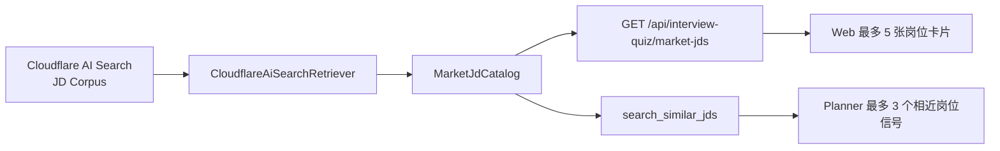
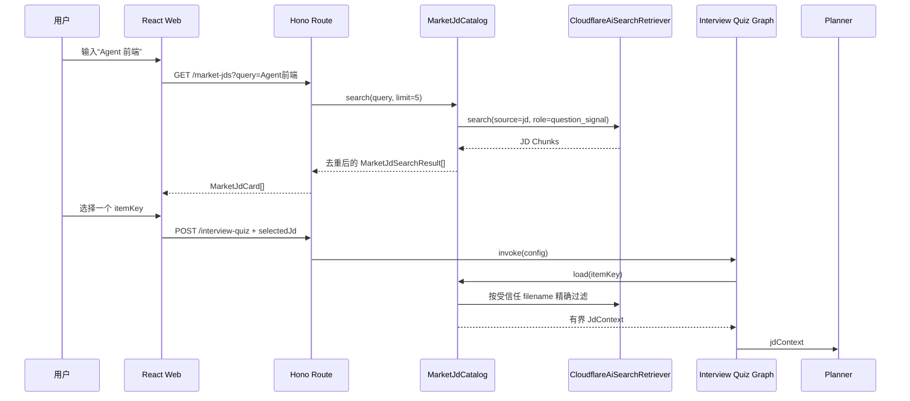
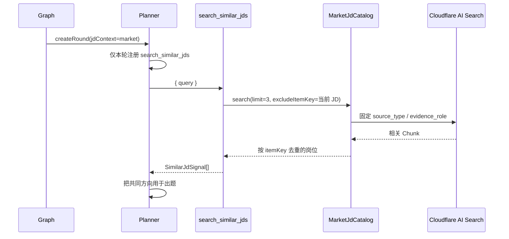

# 06E：用 JD 决定“考什么”

## 1. 这一章最终做出什么

第 06E 章把同一套 Interview Quiz Graph 扩展成三种启动方式：

1. 不使用 JD，按 Agent 工程通用方向出题；
2. 用户粘贴一份 JD，服务端导入后按这份 JD 出题；
3. 用户搜索市场 JD，从 Web 返回的 5 个岗位中选择一份，再按该岗位出题。

当用户选择市场 JD 时，Planner 还会得到一个可选的
`search_similar_jds` Function Tool，用来查询最多 3 份相近岗位，补充市场上共同关注的知识点。

本章始终坚持一条信任边界：

```text
JD / 八股资料      → question_signal → 决定考什么
核验后的官方资料   → answer_evidence → 决定答案是否正确
```

JD 不能写入题目的 `sourceChunkIds`，也不能证明某个技术答案正确。

## 2. 为什么需要两条市场 JD 入口

Web 搜索和 Planner Tool 都会查询同一批 Cloudflare AI Search JD，但用途不同：

| 入口 | 调用者 | 返回数量 | 用途 |
| --- | --- | ---: | --- |
| 市场 JD 搜索 API | Web 用户 | 最多 5 份 | 让用户明确选择目标岗位 |
| `search_similar_jds` | Planner | 最多 3 份 | 在已选岗位基础上寻找共同要求 |

Web 搜索不是 Function Tool。用户需要稳定地看到岗位卡片并主动选择，没必要让模型参与。

Planner Tool 也不能直接复用 Web DTO。模型只需要有界的出题信号，不需要薪资、完整岗位描述或 5 张 UI 卡片。

两条入口不能各写一套 Cloudflare 请求。它们共同依赖 `MarketJdCatalog`：



## 3. 完整类型

### 3.1 Web 传入的 JD 引用

外部输入使用 Zod；进入 Graph 后使用推导出的 TypeScript 类型，不在 Node 之间反复 `.parse()`。

```ts
export enum SelectedJdSource {
  UserUpload = 'user_upload',
  Market = 'market',
}

export const SelectedJdReferenceSchema = z.discriminatedUnion('source', [
  z.object({
    source: z.literal(SelectedJdSource.UserUpload),
    documentId: z.string().min(1),
  }).strict(),
  z.object({
    source: z.literal(SelectedJdSource.Market),
    itemKey: z.string().regex(
      /^question-signal\/jd-market\/jd-market-[a-f0-9]+\.md$/,
    ),
  }).strict(),
])

export type SelectedJdReference
  = z.infer<typeof SelectedJdReferenceSchema>
```

为什么不继续只用 `jdDocumentId`：用户上传 JD 的 `documentId` 带 learner owner 边界；市场 JD 使用 Cloudflare `itemKey`。把两者伪装成同一种 ID，会让 Graph 不知道应该调用本地 Store 还是市场目录。

`QuizConfigSchema` 只增加一个可选字段：

```ts
export const QuizConfigSchema = z.object({
  initialDifficulty: z.enum(QuizDifficulty),
  maxRounds: z.number().int().min(1).max(3),
  selectedJd: SelectedJdReferenceSchema.optional(),
}).strict()
```

### 3.2 当前 Graph 使用的有界 JD 上下文

```ts
export interface JdContext {
  reference: SelectedJdReference
  title: string
  focusKnowledgePoints: string[]
}
```

Graph State 不保存完整 JD，只保存这三个字段。Checkpoint 因此不会复制整份岗位描述。

### 3.3 市场 JD 目录类型

```ts
export interface MarketJdSearchResult {
  itemKey: string
  title: string
  company: string
  location: string
  salary: string
  highlights: string[]
  focusKnowledgePoints: string[]
  summary: string
}

export interface MarketJdCard {
  itemKey: string
  title: string
  company: string
  location: string
  salary: string
  highlights: string[]
}

export interface SimilarJdSignal {
  itemKey: string
  title: string
  company: string
  focusKnowledgePoints: string[]
  summary: string
}

export interface MarketJdCatalog {
  search: (input: {
    query: string
    limit: number
    excludeItemKey?: string
    signal: AbortSignal
  }) => Promise<MarketJdSearchResult[]>

  load: (input: {
    itemKey: string
    signal: AbortSignal
  }) => Promise<JdContext | null>
}
```

`MarketJdSearchResult` 是目录内部的完整搜索结果。Route 把它投影成 `MarketJdCard`；Tool 把它投影成 `SimilarJdSignal`。两边不重复检索，也不会把不需要的字段发给各自调用方。

### 3.4 Planner Tool 输入

```ts
export const SearchSimilarJdsInputSchema = z.object({
  query: z.string().trim().min(2).max(200),
}).strict()
```

模型只能提交 `query`。以下字段全部由服务端固定：

- `source_type = jd`；
- `evidence_role = question_signal`；
- 最多返回 3 份不同 JD；
- 排除当前已经选择的 `itemKey`；
- 每轮最多调用一次；
- 按 `itemKey` 去重，不能让同一 JD 的多个 Chunk 占满结果。

## 4. 文件结构

```text
src/
├─ agent/interview-quiz/
│  ├─ jd/
│  │  ├─ contracts.ts              # JD 引用、Context、Web/Tool DTO
│  │  ├─ import-jd.ts              # 用户粘贴 JD 的导入链路
│  │  ├─ extract-jd-focus.ts       # 确定性提取 Agent 重点
│  │  └─ market-jd-catalog.ts      # 共享市场 JD 目录与 Markdown 投影
│  ├─ tools/
│  │  └─ jd.ts                     # search_similar_jds Function Tool
│  ├─ interview-quiz-graph.ts      # load_jd_context 分流
│  └─ planning.ts                  # 只在市场 JD 模式注册 Tool
├─ routes/interview-quiz.ts        # 市场 JD 搜索 API
└─ composition-root.ts             # 组装 Retriever、Catalog、Graph、Route

web/src/
├─ api.ts                          # 市场 JD API 和 selectedJd 类型
└─ InterviewQuizDemo.tsx           # 搜索、选择与开始答题
```

不新增 Repository、Service、UseCase 等同义包装层。`MarketJdCatalog` 已经是 Graph、Route 和 Tool 共同需要的应用边界。

## 5. 谁调用谁

### 5.1 用户选择市场 JD



### 5.2 Planner 查询相近 JD



## 6. 每个函数和 Node 的输入输出

| 函数 / Node | 输入 | 输出 | 失败时 |
| --- | --- | --- | --- |
| `MarketJdCatalog.search` | query、受控 limit、可选 exclude | 去重后的市场 JD | 抛 Adapter 错误，由 Route 或 Tool 映射 |
| `MarketJdCatalog.load` | 受校验的 itemKey | `JdContext \| null` | 查不到返回 null；请求失败抛错 |
| `GET /market-jds` | query string | 最多 5 个 `MarketJdCard` | 安全 HTTP 错误，不返回 Cloudflare 原文 |
| `load_jd_context` | `config.selectedJd` | `jdContext` | 写稳定 Graph Error 并进入 failed |
| `search_similar_jds` | 模型 query | 最多 3 个 `SimilarJdSignal` | Tool 失败，Planner 转成稳定错误 |
| `plan_execute` | JD Context、Memory、题库排除、RAG | 一轮五题 | JD 只能影响方向，答案仍需官方证据 |

## 7. 实现顺序

1. 把 `jdDocumentId?` 替换成 `selectedJd?` 判别联合；
2. 实现 `MarketJdCatalog`，解析已脱敏 Markdown；
3. 让 Cloudflare Retriever 支持服务端受信任的 `documentIds → filename` 精确过滤；
4. 增加市场 JD 搜索 API，固定返回 5 张卡片；
5. 改造 `load_jd_context`，分别读取用户上传 JD 和市场 JD；
6. Web 增加搜索、五选一和取消选择；
7. 增加 `search_similar_jds` Tool；
8. Planner 只在选择市场 JD 时注册 Tool，并执行一次调用预算；
9. 补 Fake 单测；真实 Cloudflare 只做 Smoke Test。

## 8. 测试和验收标准

### 8.1 Catalog 单测

- 同一 `itemKey` 返回多个 Chunk 时只生成一份 JD；
- 正确解析标题、公司、地点、薪资和技能标签；
- `limit=5` 不返回第 6 份；
- `excludeItemKey` 不会出现在结果；
- `load` 必须提交 `documentIds=[itemKey]`，不能用无过滤的相似搜索冒充精确读取；
- 查不到时返回 `null`。

### 8.2 Tool 单测

- Schema 只接受 `query`；
- 服务端固定 limit=3；
- 自动排除当前 JD；
- 输出只包含 `SimilarJdSignal`；
- 同一轮第二次调用会被 Planner 拒绝。

### 8.3 Graph / HTTP 单测

- 不传 `selectedJd` 时保持 06D 行为；
- 用户上传引用仍按 `learnerId + documentId` 读取；
- 市场引用改由 `MarketJdCatalog.load` 读取；
- 非法 itemKey 在 HTTP 边界被拒绝；
- Web 搜索最多返回 5 张不同岗位卡片；
- Graph State 和 Web 均看不到完整市场 JD。

### 8.4 最终验证

```powershell
bun run check
bun run build:web
bun test tests/smoke/cloudflare-ai-search.smoke.test.ts
```

Smoke 只证明真实配置下的查询链路可用；业务边界、去重、预算和错误映射仍由 Fake 单测证明。

## 9. 当前暂不处理什么

- 不让模型自由浏览全部 96 份 JD；
- 不保存用户对市场 JD 的收藏、投递或匹配分数；
- 不用 LLM 单独生成 JD 分析报告；
- 不把 3 份完整相近 JD 塞入 Planner；
- 不把 JD 当成技术事实来源；
- 不实现跨进程的市场搜索结果缓存；
- 不引入 Reviewer、子 Agent 或并行 JD 分析；
- 不在 06E 拆分 Plan / Execute / RePlan Subgraph。

完成这一章后，重点不是记住 Cloudflare 参数，而是能解释：同一份外部资料如何经过 Catalog，分别服务确定性 Web 交互和模型 Tool，同时保持信任边界、返回预算与 Graph State 有界。
