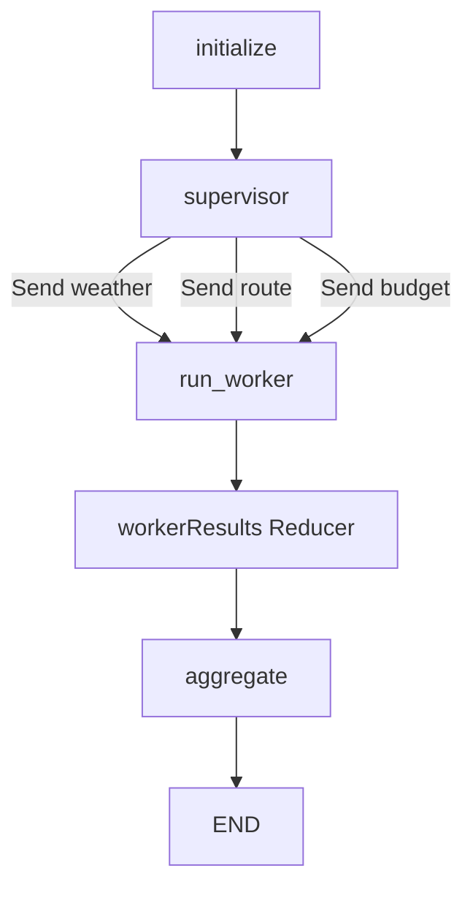

# 旅行行程助手：Multi-Agent 最小学习 Demo

这个目录是独立的教学演示，不参与现有 Interview Quiz 业务。

## 它要演示什么

用户提交一份旅行需求：

```text
周末去深圳两天，预算 1500 元，带老人，希望安排轻松一点。
```

Supervisor 创建三个固定任务：

```text
Weather Worker：天气建议
Route Worker：路线建议
Budget Worker：预算估算
```

然后使用 LangGraph 的 `Send` 把三个 Assignment 派发给同一个 `run_worker` Node，最后由 `aggregate` 合并结果。



## 文件职责

| 文件 | 作用 |
| --- | --- |
| `contracts.ts` | Assignment、Worker、Result 和最终 Plan 类型 |
| `state.ts` | Graph State，以及并行结果的 Reducer |
| `workers.ts` | 三个确定性的 Fake Worker；不访问网络、不调用 LLM |
| `graph.ts` | Supervisor、`Send`、`run_worker`、Aggregator 和 Graph 连线 |
| `README.md` | 学习入口和边界说明 |

## 先看哪几处

1. 先看 `contracts.ts`，理解“一个 Worker 接收什么、返回什么”。
2. 再看 `graph.ts` 的 `dispatchAssignments`，观察 `Send` 如何把不同 Assignment 送到同一个 Node。
3. 再看 `state.ts` 的 `workerResults` Reducer，理解并行结果如何合并。
4. 最后看 `aggregateWorkerResults`，理解完整成功、部分成功和全失败的区别。

## 第一版明确不做什么

- 不调用 OpenAI；
- 不调用真实天气、地图或搜索服务；
- 不使用 `Command`、`interrupt` 或子图；
- 不允许模型动态创建 Worker；
- 不实现远程队列、A2A、MCP 或分布式调度。

以后如果要升级，只替换 `workers.ts` 中某个 Worker 的 `run` 实现即可。它可以在内部调用现有 `ToolLoopGraph`，但 Supervisor、Assignment、`Send` 和 Aggregator 的边界不需要改变。
